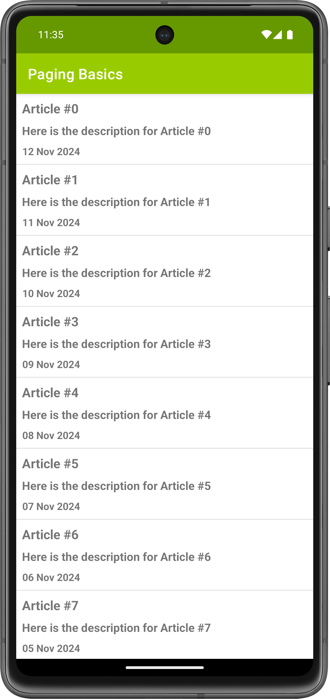
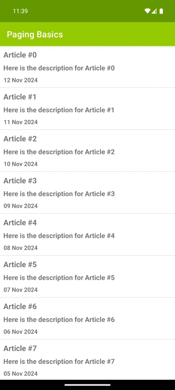

# Paging Basics
### **Purpose:** An Android app that displays a list of items with pagination
### **Codelab Link:** https://developer.android.com/codelabs/android-paging-basics
---

## Demo
</img>
</img>

## Build tools & versions used
- Macbook with an M-series chip
- Android Studio Koala | 2024.1.1 Patch 1

## Steps to run the app
- With the latest version of Android Studio, run the app on an emulator with an AVD that has an Android min. SDK version of 24.
- Tested with: Pixel 7 API 35
